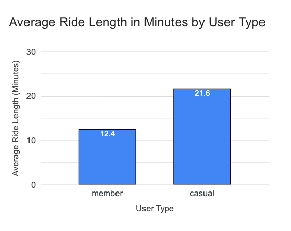
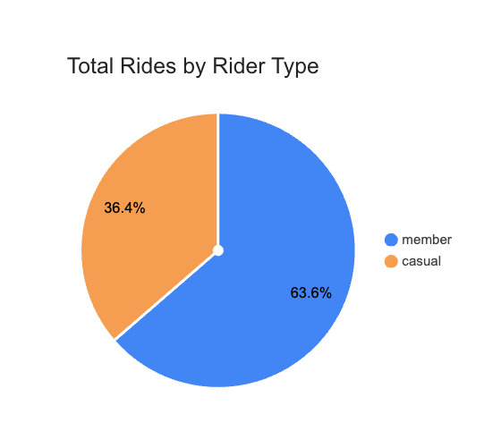
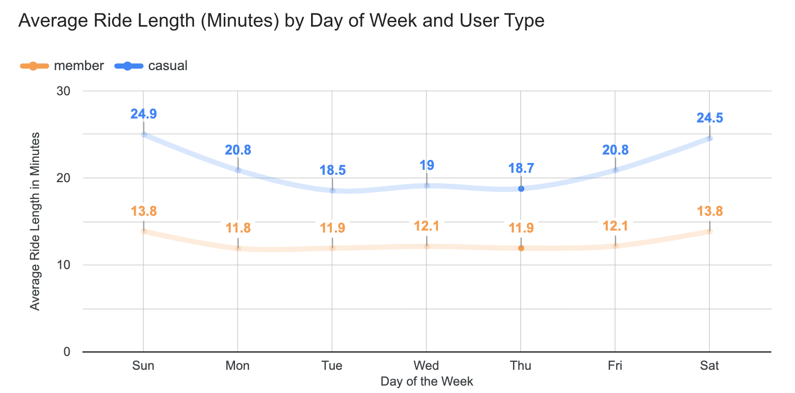
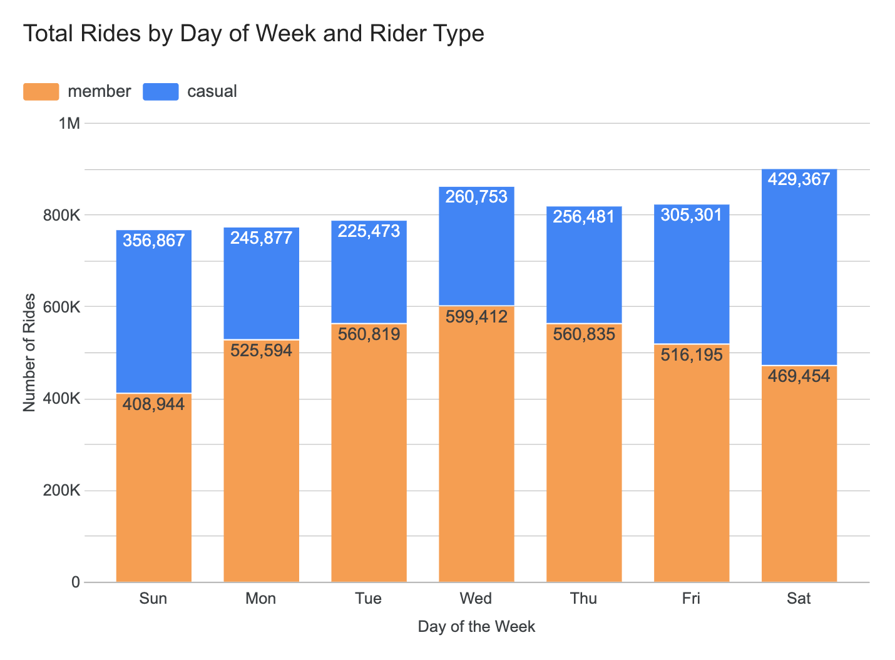
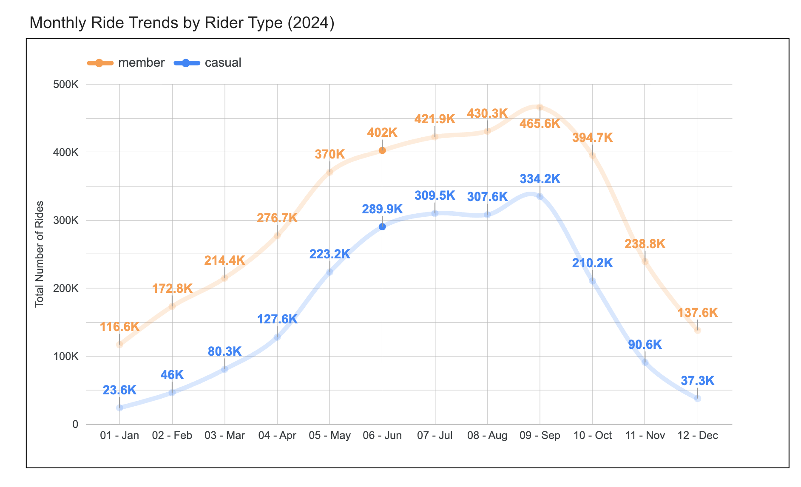

# 🚴 Divvy Case Study 

### 🧭 Project Description  
This project analyzes **12 months of Divvy bike-share data** to understand how **annual members** and **casual riders** use the service differently — and identify actionable strategies to **convert casual riders into annual members**.  

Divvy operates Chicago’s bike-share system with **5,800+ bikes** and **600+ docking stations**. Using **SQL in Google BigQuery** and **Looker Studio visualizations**, this analysis explores ride duration, frequency, and seasonal patterns to help the company grow its annual memberships and improve customer retention.  

---

## 🧰 Tools & Technologies  
| Tool | Purpose |
|------|----------|
| **Google Cloud Storage** | Store and organize monthly ride data |
| **BigQuery (SQL)** | Clean, transform, and analyze datasets |
| **Looker Studio** | Build and visualize analytical dashboards |
| **Google Sheets / Excel** | Validate and cross-check calculations |

---

## 🧹 Data Preparation Process  

1. **Data Upload:**  
   - All 12 months of Divvy trip data (Jan–Dec 2024) were uploaded into **Google Cloud Storage**.  

2. **BigQuery Integration:**  
   - Each CSV was combined into a single table `tripdata_all`.  
   - Schema was auto-detected with columns like `ride_id`, `rideable_type`, `started_at`, `ended_at`, `start_station_name`, `end_station_name`, `start_lat`, `start_lng`, `end_lat`, `end_lng`, and `member_casual`.

3. **Filtering and Validation:**  
   - Removed rows with `NULL` or invalid timestamps and coordinates.  
   - Ensured `ended_at > started_at`.  
   - Filtered lat/long values between **40–43°N** and **–88 to –87°W** to focus on Chicago rides.  

4. **Feature Engineering:**  
   - Added new fields for analytics:
     | Column | Description |
     |---------|-------------|
     | `ride_length_minutes` | Trip duration (`ended_at - started_at`) in minutes |
     | `day_of_week` | Extracted weekday (1=Sun to 7=Sat) |
     | `month_name` | Month label for visualizations |

---

## 🧮 Key Calculations  

### 🔹 Summary Statistics  
| Metric | Value (minutes) |
|:--|:--:|
| **Maximum Ride Length** | 1509.37 |
| **Average Ride Length** | 15.48 |

### 🔹 Average Ride Length by Rider Type  
| Rider Type | Avg Ride (min) |
|-------------|----------------|
| Member | 12.40 |
| Casual | 21.55 |

### 🔹 Total Rides by Rider Type  
| Rider Type | Total Rides |
|-------------|--------------|
| Casual | 2,080,119 |
| Member | 3,641,253 |

### 🔹 Average Ride by Day of Week  
| Day | Avg Ride (min) |
|------|----------------|
| Sunday | 18.99 |
| Monday | 14.71 |
| Tuesday | 13.76 |
| Wednesday | 14.19 |
| Thursday | 14.02 |
| Friday | 15.35 |
| Saturday | 18.92 |

---
## 📊 Visualizations & Insights

### 🟦 1️⃣ Average Ride Length by Rider Type

This chart compares the **average ride duration** between **casual riders** and **annual members**.  
- **Casual riders** have an average trip length of **21.6 minutes**, nearly **75% longer** than members.  
- **Members** average **12.4 minutes** per trip, suggesting their rides are shorter and likely **commuting-oriented**.  

📈 **Interpretation:**  
Casual users tend to ride for leisure or recreation, taking longer trips, while members primarily use the service for quick, purpose-driven commutes such as work or errands.

---

### 🟩 2️⃣ Total Rides by Rider Type

This pie chart displays the **overall distribution of trips** between user types.  
- **Members** account for **63.6% of total rides**, while **casual riders** represent **36.4%**.  

📈 **Interpretation:**  
Despite casual riders taking longer trips, members generate nearly **two-thirds of total platform activity**, indicating a stronger base of **repeat and loyal users**. This reinforces the value of converting more casual riders into members to ensure consistent usage and revenue.

---

### 🟨 3️⃣ Average Ride Length by Day of the Week

This line chart shows **ride duration trends across days of the week** for both rider types.  
- Casual riders maintain longer rides throughout the week, peaking on **Sundays (24.9 min)** and **Saturdays (24.5 min)**.  
- Members’ ride lengths are consistent, averaging around **12 minutes** across all days.  

📈 **Interpretation:**  
Weekend peaks for casual users highlight **recreational use** on non-workdays, while the stability in member ride duration aligns with **routine weekday commuting**.

---

### 🟥 4️⃣ Total Rides by Day of the Week

This stacked bar chart visualizes **ride volume by day of the week**, separated by rider type.  
- Members dominate weekday rides (Mon–Fri), averaging over **550K trips** midweek.  
- Casual riders show higher counts on **weekends**, with **Saturday (429K)** and **Sunday (356K)** being their busiest days.  

📈 **Interpretation:**  
- Members rely on Divvy for **regular, utilitarian travel**, likely commuting.  
- Casual riders use it mainly for **weekend recreation** and tourism.  
This insight suggests targeting **weekend promotions** or **short-term passes** to convert high-traffic casual users.

---

### 🟪 5️⃣ Monthly Ride Trends by Rider Type

This line chart shows **seasonal ride trends** throughout 2024 for both user types.  
- Ride volume peaks during **summer months (June–September)**, with **members reaching 465.6K rides in September** and **casuals peaking at 334.2K**.  
- Both groups decline during **winter (Nov–Feb)** due to colder weather.  
- Members maintain relatively **steady activity year-round**, while casual riders drop sharply in off-season months.  

📈 **Interpretation:**  
- Casual usage is **seasonally dependent**, driven by weather and tourism.  
- Members provide **consistent baseline ridership**, contributing to predictable revenue.  
Marketing efforts should focus on converting **summer casual users** into **annual members** before winter slowdowns.

---

## 🧩 Summary of Insights Across Visuals  

| Theme | Observation | Business Takeaway |
|--------|--------------|------------------|
| **Ride Duration** | Casual riders take longer trips (avg 21.6 min) | Leisure usage dominates casual behavior |
| **Ride Frequency** | Members contribute 63.6% of rides | Membership = long-term retention |
| **Weekly Trends** | Casual riders spike on weekends | Target weekend promotions |
| **Seasonal Trends** | Rides surge in summer | Run seasonal campaigns for conversions |
| **Member Stability** | Members maintain usage year-round | Reinforce loyalty programs |

---

These visuals collectively illustrate that:
- Members ride **more often but shorter distances**.  
- Casual riders are **less frequent but ride longer and mostly on weekends**.  
- There is a strong **opportunity to convert casual riders** during high-traffic summer months through tailored membership incentives.
---

## 💡 Key Insights  

| Insight | Implication |
|----------|-------------|
| Casual riders take longer but fewer rides. | They likely use bikes for leisure or recreation. |
| Members ride shorter, frequent trips. | Indicates commuting and daily use. |
| Weekends & summer show spikes for casual riders. | Marketing should target seasonal and weekend promotions. |
| Members maintain steady usage. | Annual memberships support consistent revenue flow. |

---

## 🎯 Recommendations  

1. **Seasonal Trial Memberships:** Offer discounted summer memberships to convert casual riders.  
2. **Weekend/Flex Passes:** Create flexible membership tiers for leisure-focused riders.  
3. **Commuter Campaigns:** Highlight savings and convenience for regular weekday riders.  
4. **Local Partnerships:** Bundle memberships with hotels, events, and tourist attractions.  
5. **Loyalty Rewards:** Incentivize frequent casual riders to upgrade through milestone rewards.
